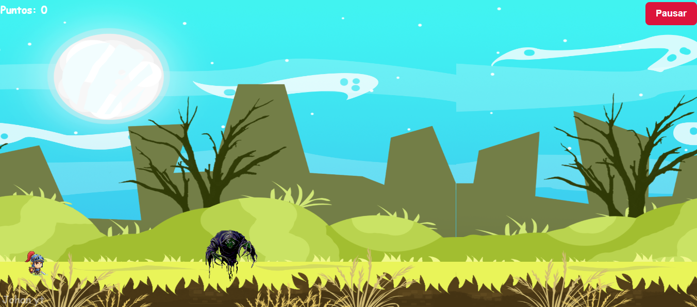

# 👾 Monster Jump

Un juego arcade en 2D desarrollado con **HTML, CSS y JavaScript**, donde controlas a un caballero que debe esquivar monstruos 
y a medida que los ira esquivando se pondra mucho mas dificil pero iras obteniendo mas puntos el reto consiste en no dejarte matar por
los monstruos lo mas que puedas ya que si lo haces seras una florecita 😂 .  

---

## 🚀 Demo en Vivo
👉 [Prueba el juego aquí](https://joganyt01.github.io/Monster-Jump/)

---

## 📸 Captura del juego

<table>
  <tr>
    <td align="center"><b>Desktop</b></td>
  </tr>
  <tr>
    <td></td>
  </tr>
</table>

---

## ✨ Características

- 🎮 Control sencillo con teclado (*flechas* o *teclas asignadas*).  
- 🟩 Plataformas generadas aleatoriamente para mayor dinamismo.  
- ⚡️ Botón **Play** para iniciar y **Reinicio** para volver a empezar.  
- 🎵 Música y efectos de sonido para una experiencia inmersiva.  
- 📊 Contador de puntaje en tiempo real.  
- 🎨 Diseño retro con sprites coloridos.  

---

## 🛠️ Requisitos

- Navegador moderno (Chrome, Edge, Firefox, Safari).  
- Conexión a internet para acceder al sitio.  

---

## 📂 Estructura del proyecto

monster-jump/  
├── index.html   # Página principal  
├── style.css    # Estilos del juego  
├── script.js    # Lógica del juego  
├── img/         # Carpeta con sprites e imágenes  
└── sonidos/     # Carpeta con efectos y música  

---

## 👨‍💻 Autor

Desarrollado con ❤️ por **Johanyt**  

---
